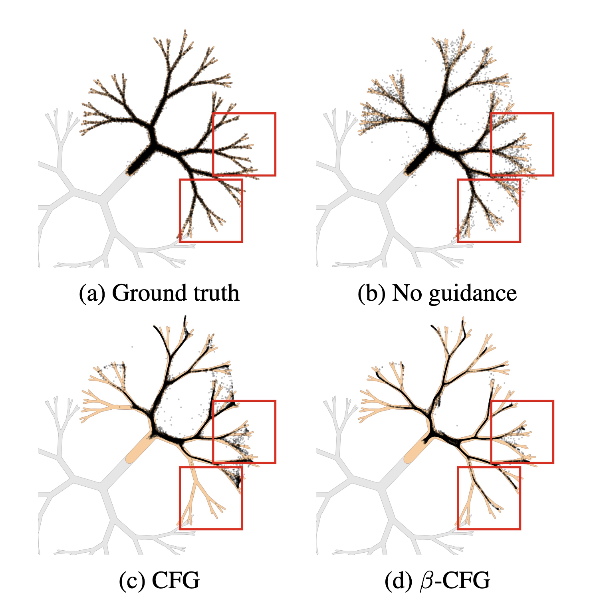

# Classifier-free Guidance with Adaptive Scaling


[](https://arxiv.org/abs/2406.08070)

> Classifier-free guidance (CFG) is an essential mechanism in contemporary text-driven diffusion models. In practice, in controlling the impact of guidance we can see the trade-off between the quality of the generated images and correspondence to the prompt. When we use strong guidance, generated images fit the conditioned text perfectly but at the cost of their quality. Dually, we can use small guidance to generate high-quality results, but the generated images do not suit our prompt. In this paper, we present β-CFG (β-adaptive scaling in Classifier-Free Guidance), which controls the impact of guidance during generation to solve the above trade-off. First, β-CFG stabilizes the effects of guiding by gradient-based adaptive normalization. Second, β-CFG uses the family of single-modal (β-distribution), time-dependent curves to dynamically adapt the trade-off between prompt matching and the quality of samples during the diffusion denoising process. Our model obtained better FID scores, maintaining the text-to-image CLIP similarity scores at a level similar to that of the reference CFG.

This repository is the official implementation of [β-CFG](https://arxiv.org/pdf/2502.10574), led by  
[Dawid Malarz*](), [Artur Kasymov*](), [ Maciej Zieba](), [Jacek Tabor](), [Przemysław Spurek]()


<p align="center">
  
</p>


---
## 🔥 Summary

Classifier-free guidance (CFG) is a fundamental technique in modern text-to-image diffusion models. Although effective, CFG introduces a trade-off between image quality and alignment with the text prompt. High guidance scales improve adherence to the prompt but degrade image quality, while low guidance scales improve image quality at the expense of prompt alignment.

We propose β-CFG 🚀 — a method that dynamically adjusts the guidance strength during the sampling process using time-dependent β-distribution scaling. This modification provides several benefits:

- Dynamic, adaptive guidance — guidance strength evolves across the sampling trajectory to balance quality and prompt adherence.
- Better image quality at lower guidance scales compared to standard CFG.
- Smoother sampling trajectories that stay closer to the data manifold, reducing off-manifold deviations.
- Consistently improved FID scores while maintaining similar CLIP scores to standard CFG.

β-CFG is easy to implement and offers a flexible, principled way to enhance text-to-image generation in diffusion models.


## 🛠️ Setup
> This code is based on the repository available at: https://github.com/CFGpp-diffusion/CFGpp

First, create your environment. We recommend using the following comments. 

```
git clone https://github.com/gmum/beta-CFG
cd beta-CFG
conda env create -f environment.yaml
```

## 🌄 Examples
### Text-to-Image generation
- CFG
```
python -m examples.text_to_img --prompt "a portrait of a dog" --method "ddim_geo_beta" --cfg_guidance 7.5 --a 2.0 --b 3.0 --gamma 1.0
```


## 📝 Citation
If you find our method useful, please cite as below or leave a star to this repository.

```
@article{malarz2025classifier,
  title={Classifier-free Guidance with Adaptive Scaling},
  author={Malarz, Dawid and Kasymov, Artur and Zi{\k{e}}ba, Maciej and Tabor, Jacek and Spurek, Przemys{\l}aw},
  journal={arXiv preprint arXiv:2502.10574},
  year={2025}
}
```

```
@article{chung2024cfg++,
  title={CFG++: Manifold-constrained Classifier Free Guidance for Diffusion Models},
  author={Chung, Hyungjin and Kim, Jeongsol and Park, Geon Yeong and Nam, Hyelin and Ye, Jong Chul},
  journal={arXiv preprint arXiv:2406.08070},
  year={2024}
}
```

> This work is currently in the preprint stage, and there may be some changes to the code.
